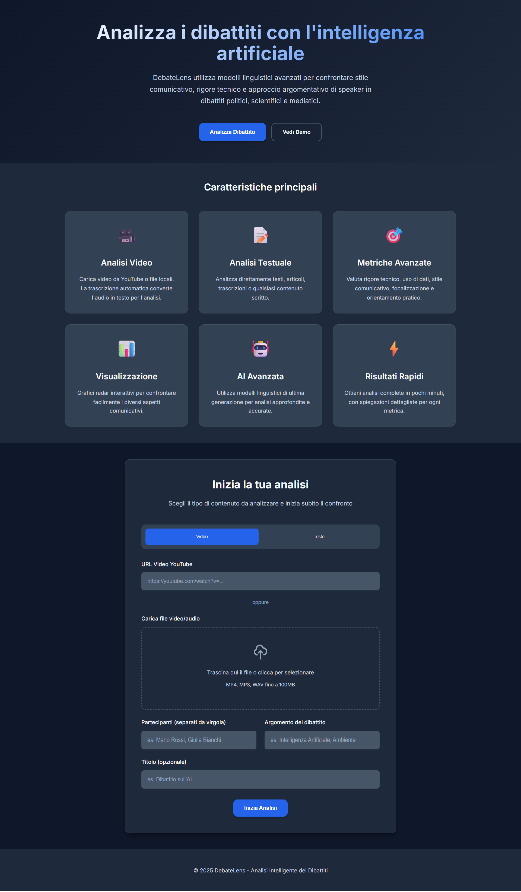
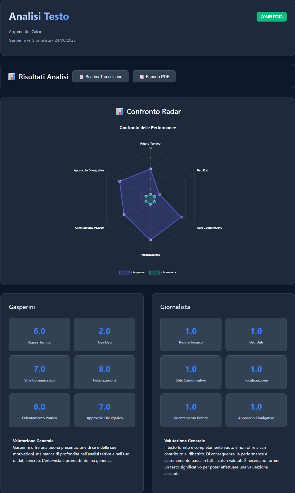
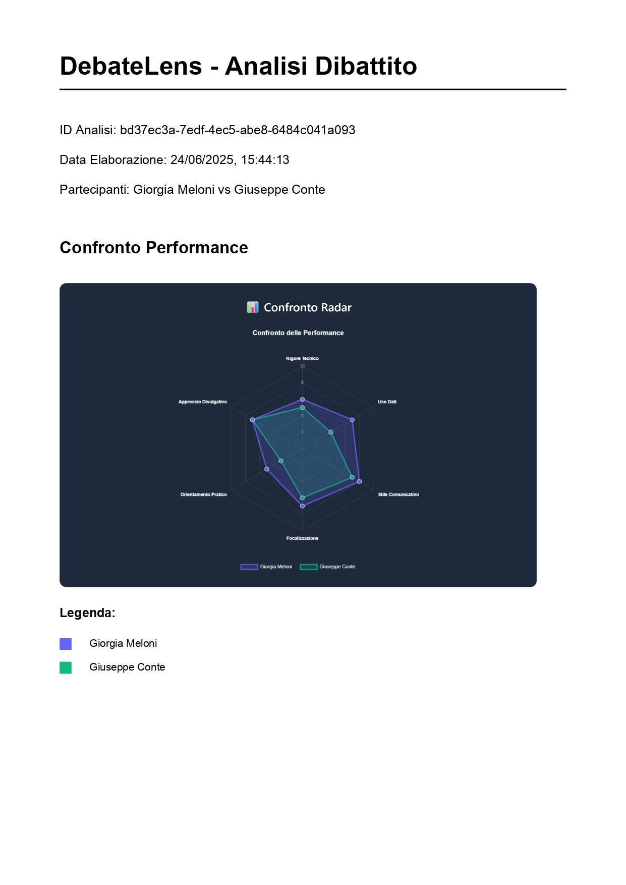
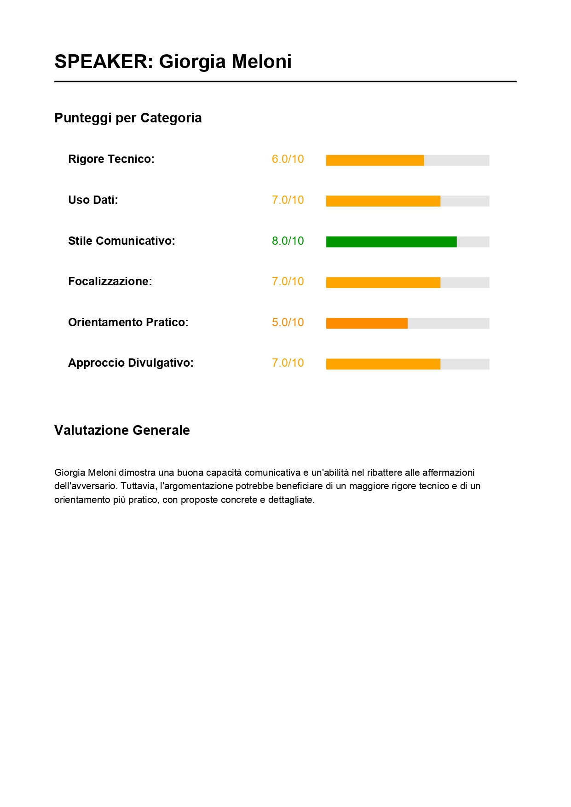
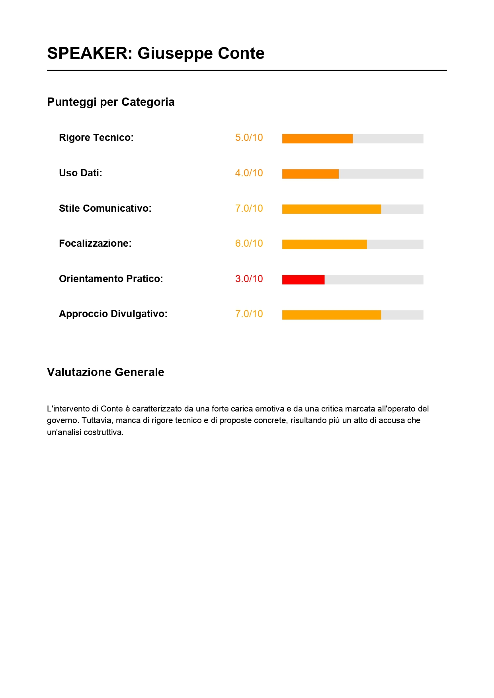
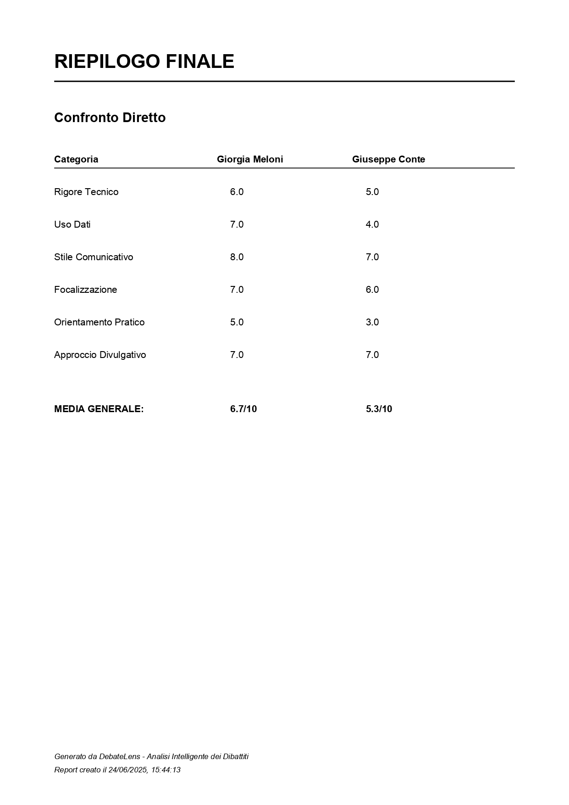

# 🎯 DebateLens

**Analisi Intelligente dei Dibattiti con AI**

DebateLens è un'applicazione web avanzata che utilizza l'intelligenza artificiale per analizzare e confrontare le performance comunicative dei partecipanti in dibattiti politici, scientifici e mediatici.

## 🖼️ Demo dell'Applicazione

### 🏠 Landing Page - Interfaccia Principale


> **Interfaccia Utente**: La landing page presenta due opzioni principali per l'analisi:
> - **📹 Analisi Video**: Inserisci URL YouTube o carica file audio/video locali
> - **📝 Analisi Testo**: Incolla direttamente il testo del dibattito da analizzare
> 
> L'interfaccia è pulita e intuitiva, con form separati per ogni modalità di analisi.

### 📊 Pagina Risultati - Caso Studio: Gasperini vs Giornalista


> **Caso Particolare**: Questo esempio mostra l'analisi di un'intervista dove il giornalista ha fatto solo **domande secche** senza argomentazioni proprie. Il sistema ha correttamente assegnato **punteggio 1.0/10** in tutte le categorie al giornalista, dimostrando la precisione dell'AI nel distinguere tra chi argomenta e chi si limita a porre domande.

### 📄 Export PDF Professionale
<div align="center">
  
  
</div>
<div align="center">
  
  
</div>

> **Export Professionale**: Il sistema genera automaticamente un PDF completo con:
> - **Pagina 1**: Copertina con informazioni generali e grafico radar comparativo
> - **Pagina 2**: Analisi dettagliata Giorgia Meloni con punteggi colorati
> - **Pagina 3**: Analisi dettagliata Giuseppe Conte con punteggi colorati  
> - **Pagina 4**: Riepilogo finale con tabella comparativa e conclusioni
> 
> Il PDF è ottimizzato per la stampa e la condivisione professionale.

## ✨ Caratteristiche Principali

### 🎥 **Analisi Multi-formato**
- **Video YouTube**: Analisi diretta da URL YouTube
- **File Audio/Video**: Upload di file locali (MP4, MP3, WAV)
- **Testo**: Analisi diretta di trascrizioni o articoli

### 🤖 **AI Avanzata**
- **Modello**: Google Gemini 2.0 Flash (gratuito via OpenRouter)
- **Trascrizione**: Whisper locale (nessun costo API)
- **Analisi**: 6 metriche di valutazione approfondite

### 📊 **Metriche di Valutazione**
1. **Rigore Tecnico**: Precisione e accuratezza delle informazioni
2. **Uso di Dati**: Quantità e qualità di statistiche e fonti
3. **Stile Comunicativo**: Chiarezza ed efficacia della comunicazione
4. **Focalizzazione**: Aderenza al topic e coerenza argomentativa
5. **Orientamento Pratico**: Concretezza delle proposte
6. **Approccio Divulgativo**: Capacità di rendere accessibili concetti complessi

### 📈 **Visualizzazione**
- **Grafici Radar**: Confronto interattivo delle performance con visualizzazione esagonale
- **Tabelle Dettagliate**: Punteggi colorati e spiegazioni per ogni categoria
- **Export PDF Multi-pagina**: Report professionali con 4 pagine complete
- **Download Trascrizioni**: File TXT con analisi complete
- **Riconoscimento Intelligente**: Distingue tra argomentatori e intervistatori
- **Interfaccia Dual-Mode**: Supporto sia video che testo con UI dedicata

## 🚀 Installazione e Setup

### Prerequisiti
- **Node.js** 16+ 
- **Python** 3.8+ (per Whisper)
- **FFmpeg** (per elaborazione audio/video)

### 1. Clone del Repository
```bash
git clone https://github.com/tuousername/debatelens.git
cd debatelens
```

### 2. Installazione Dipendenze Node.js
```bash
npm install
```

### 3. Installazione FFmpeg
**Windows (con winget):**
```bash
winget install --id=Gyan.FFmpeg
```

**macOS (con Homebrew):**
```bash
brew install ffmpeg
```

**Ubuntu/Debian:**
```bash
sudo apt update
sudo apt install ffmpeg
```

### 4. Installazione Whisper
```bash
pip install openai-whisper
```

### 5. Configurazione
1. Copia il file di configurazione:
```bash
cp config.example.js config.js
```

2. Modifica `config.js` con le tue credenziali:
```javascript
module.exports = {
    openrouter: {
        apiKey: 'TUA_API_KEY_OPENROUTER', // Gratuita da https://openrouter.ai
        model: 'google/gemini-2.0-flash-exp:free'
    },
    whisper: {
        model: 'base', // tiny, base, small, medium, large
        language: 'it'
    }
};
```

### 6. Avvio del Server
```bash
npm start
```

L'applicazione sarà disponibile su: `http://localhost:3000`

## 🔧 Configurazione Avanzata

### Variabili d'Ambiente
Crea un file `.env` per configurazioni personalizzate:
```env
PORT=3000
NODE_ENV=development
OPENROUTER_API_KEY=your_api_key_here
WHISPER_MODEL=base
UPLOAD_MAX_SIZE=100mb
RATE_LIMIT_MAX=100
RATE_LIMIT_WINDOW=900000
```

### Modelli Whisper Disponibili
- `tiny`: Veloce, meno accurato (39 MB)
- `base`: Bilanciato (74 MB)
- `small`: Buona accuratezza (244 MB)
- `medium`: Alta accuratezza (769 MB)
- `large`: Massima accuratezza (1550 MB)

## 📁 Struttura del Progetto

```
debatelens/
├── 📄 index.html              # Frontend principale
├── 🎨 styles.css              # Stili CSS
├── ⚡ script.js               # JavaScript frontend
├── 🚀 server.js               # Server Express
├── ⚙️ config.js               # Configurazione
├── 📦 package.json            # Dipendenze Node.js
├── 🖼️ assets/                 # Immagini e demo
│   ├── landing.png            # Landing page principale
│   ├── gasperini_giornalista.png # Pagina risultati
│   ├── demo-overview.jpg      # PDF export - Pagina 1 (Overview)
│   ├── demo-meloni.jpg        # PDF export - Pagina 2 (Meloni)
│   ├── demo-conte.jpg         # PDF export - Pagina 3 (Conte)
│   └── demo-summary.jpg       # PDF export - Pagina 4 (Summary)
├── 🔧 routes/                 # API endpoints
│   ├── analysis.js            # Endpoint analisi
│   ├── upload.js              # Gestione upload
│   └── results.js             # Visualizzazione risultati
├── 🤖 services/               # Servizi AI
│   ├── openrouter.js          # Integrazione OpenRouter
│   └── transcription.js       # Servizio trascrizione
├── 🛠️ utils/                  # Utilità
│   ├── database.js            # Gestione SQLite
│   └── cleanup.js             # Pulizia file temporanei
├── 📁 temp/                   # File temporanei
├── 📁 uploads/                # File caricati
└── 📁 data/                   # Database SQLite
```

## 🔗 API Endpoints

### Analisi
- `POST /api/analysis/text` - Analisi testo
- `POST /api/analysis/youtube` - Analisi video YouTube
- `POST /api/analysis/upload` - Analisi file caricato

### Risultati
- `GET /api/results/:id` - Visualizza risultati
- `GET /api/results/:id/transcript` - Download trascrizione

### Utilità
- `GET /api/health` - Health check
- `POST /api/upload` - Upload file

## 🎯 Esempi di Utilizzo

### Analisi Video YouTube
```javascript
const response = await fetch('/api/analysis/youtube', {
    method: 'POST',
    headers: { 'Content-Type': 'application/json' },
    body: JSON.stringify({
        url: 'https://youtube.com/watch?v=...',
        speakers: ['Mario Rossi', 'Giulia Bianchi'],
        topic: 'Intelligenza Artificiale',
        title: 'Dibattito AI 2024'
    })
});
```

### Analisi Testo
```javascript
const response = await fetch('/api/analysis/text', {
    method: 'POST',
    headers: { 'Content-Type': 'application/json' },
    body: JSON.stringify({
        text: 'Testo del dibattito...',
        speakers: ['Speaker 1', 'Speaker 2'],
        topic: 'Argomento del dibattito'
    })
});
```

## 🛡️ Sicurezza

- **Rate Limiting**: 100 richieste per 15 minuti
- **Content Security Policy**: Headers di sicurezza configurati
- **Validazione Input**: Tutti gli input sono validati
- **CORS**: Configurazione CORS appropriata
- **File Upload**: Limitazioni su tipo e dimensione file

## 🔧 Troubleshooting

### Errori Comuni

**1. FFmpeg non trovato**
```bash
# Verifica installazione
ffmpeg -version

# Aggiungi al PATH se necessario (Windows)
setx PATH "%PATH%;C:\path\to\ffmpeg\bin"
```

**2. Whisper non funziona**
```bash
# Reinstalla Whisper
pip uninstall openai-whisper
pip install openai-whisper
```

**3. Errori di trascrizione YouTube**
```bash
# Aggiorna yt-dlp
pip install --upgrade yt-dlp
```

**4. Errori di memoria**
- Usa modelli Whisper più piccoli (`tiny` o `base`)
- Riduci la qualità video di input
- Aumenta la RAM disponibile

## 🤝 Contributi

I contributi sono benvenuti! Per contribuire:

1. Fork del repository
2. Crea un branch feature (`git checkout -b feature/nuova-funzionalita`)
3. Commit delle modifiche (`git commit -am 'Aggiunge nuova funzionalità'`)
4. Push del branch (`git push origin feature/nuova-funzionalita`)
5. Apri una Pull Request

## 📝 Licenza

Questo progetto è rilasciato sotto licenza MIT. Vedi il file [LICENSE](LICENSE) per i dettagli.

## 🙏 Ringraziamenti

- **OpenRouter** per l'accesso gratuito ai modelli AI
- **OpenAI** per Whisper
- **Google** per Gemini 2.0 Flash
- **Chart.js** per i grafici radar
- **jsPDF** per l'export PDF

## 📞 Supporto

Per supporto, bug report o richieste di funzionalità:
- Apri un [Issue](https://github.com/tuousername/debatelens/issues)
- Email: support@debatelens.com
- Discord: [DebateLens Community](https://discord.gg/debatelens)

---

**Sviluppato con ❤️ per l'analisi intelligente dei dibattiti** 